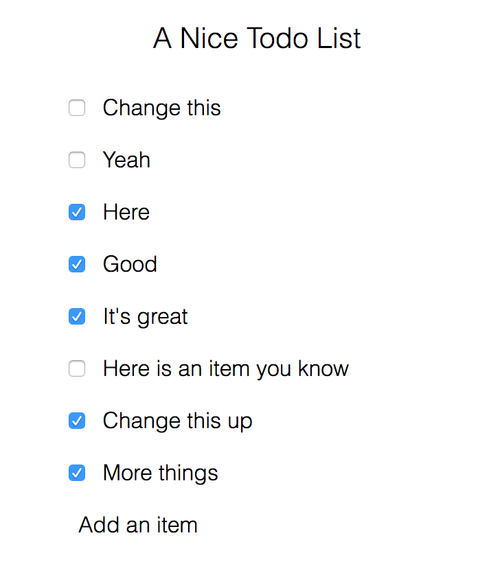

# Autoserialize

What do we want? no-pain jsonifying, devtools integration, and pretty printing
of values for debugging!

What does it look like?

```reason
type myThing = {
  something: int,
  moreThings: option string,
};
let myValue = {something: 10, moreThings: Some "hello"};
/* ooh magically myThing__to_devtools is available! */
Js.log (myThing__to_devtools myValue);
Js.log (Js.Json.stringify (myThing__to_json myValue));
switch (myThing__from_json (myThing__to_json myValue)) {
  | None => Js.log "Failed to deserialize"
  | Some roundTripped => Js.log "It worked!"
}
```

## Example screenshots!



## How battled hardened is it?

As much as a wooden horse.

## How well does it work?

As a ppx, it will only run on the code in the current project. If you want to
serialize code that includes types from other libraries, we'll need something
else (I have an idea for that too). Or we could have bucklescript run this ppx
on all of everything, which would probably have prohibitive performance
implications.
